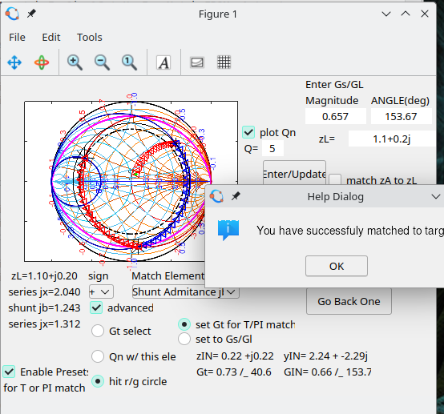

# RF-Match-Designer-Octave
An RF matching tool, featuring T PI Q Selecting Networks in yz Smithchart.  Running RF_Match_Designer.m in Octave, (or Matlab?) will Launch a gui that will aid in the design a matching network including lumped elements, including specified Q, T or Pi Matching Networks, Quarterwave Transformer design from impedances intered in the UI, or a line displacement as the elements.

